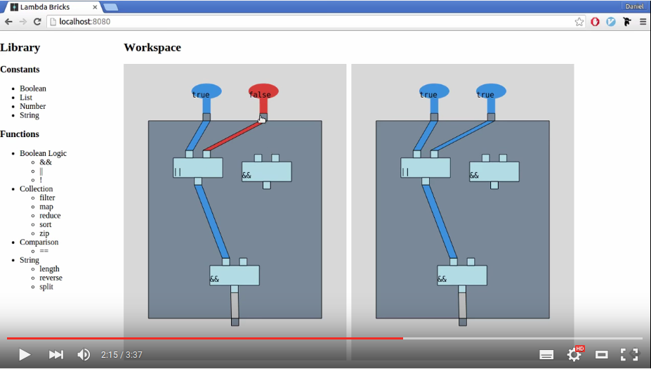

# WIP

[](http://standardjs.com/)

# Lambda Bricks

What will happen if we separate a programming language in front-end and back-end?
The back-end will be the programming language as we know it.
But in the front-end we could add new features to it, for example:
- Translations
- Multiple ways of reading and writing the code.
The code could behave as data, and we could have multiple views of it.
- etc.

This project is an experiment around this question.

[](http://www.youtube.com/watch?v=bf7bJLPxivc)

- [How this project started](#how-this-project-started)
- [Benefits](#benefits)
- [Paradigms](#paradigms)
- [Differences with similar projects](#differences-with-similar-projects)
- [Roadmap](#roadmap)
- [Further work](#further-work)
- [License](#license)
- [Development](#development)
- [Tasks](#tasks)


## How this project started

I was working in a bootcamp as a teacher,
and realized that there is a lot of incidental complexity
when someone is learning to program.

We could use the ideas above to think of a programming environment
that makes learning to program easier.
Here are some ways in which applying this ideas could help:
- Having translations or a visual representation could help non-English speakers.
- Avoid the need to know all the syntax of a programing language
before starting to program. You don't need to know where all the commas,
parenthesis, brackets, keywords, etc. are placed.
- Teach programming concepts and not a programming language.
General concepts could be applied to different programming languages later.
- All you need in one place: documentation, usage examples, tests, etc.

The project currently have the constraint that can only represent
functional languages that have some kind of pattern matching or guards.
For example: Haskell, Erlang, Elixir.

> Anything is easy if you can assimilate it to your collection of models.
> If you can't, anything can be painfully difficult.
Seymour Papert, Mindstorms.


## Benefits

It is not a new programming language.


## Paradigms

The project takes a lot of inspiration from the following paradigms:
- Dataflow programming
- Visual programming
- Functional programming
- Live programming


## Differences with similar projects

This project differentiates by 3 main ideas of other visual programming environments:
- Uses Functional Programming
- The connections between blocks are as important as the blocks.
In most of the other projects the connections are just lines.
- The execution flow is from top to bottom,
not from left to right like in most projects.
I think flow from top to bottom is more natural,
an example in the real world is gravity.


## Roadmap

### Evaluate technologies

The first step is to evaluate
if the project will continue to be developed with react/redux/canvas.
Using it in Firefox feels slow.
I don't know if it is because my limited knowledge of react/redux,
or because the project is not suited for using these technologies.
Please open an issue with your OS, browser, pc specs
if the project feels slow in your machine.

### ~~Test output~~ DONE

The same way as you select the values/types of the test inputs,
you will select the value/type of the test output.
If the test output is the same as the brick output
there will be visual cue that the test is passing.

### ~~Custom constant value input depending on type~~ DONE


### Pattern matching/Guards

The only way to do control flow will be with multiple brick heads.


### Collapse/Expand bricks

This way you could see the dataflow inside other bricks.
Also expand bricks implemented by other people to see what
is happening inside.

### Keyboard shortcuts

Just examples, the actual shortcuts will be defined later.
- B Add new brick
- C Add new constant
- L Link slots
- E Select element

I think that with just this shortcuts and some autocompletion
you could program with fewer keystrokes than even inside an IDE.
This is because with each shortcut you are narrowing a lot
the potential following actions.

### Higher order functions

Wrap bricks inside a funnel, so it can flow through a pipe.

### Search bar for defined bricks

Add a search bar for bricks with autocompletion.


### Change locale/programming language

There will be the need to implement backends in different programming languages
that can evaluate Lambda Bricks state.


## Further work

1. Do physical open-hardware toys that could teach programming to kids.
2. Translate between code (in different languages) and brick visualization.
3. Apply this ideas for tools in:
  - Debugging
  - Refactoring
  - Navigating code
  - Visualization of a project architecture


## License

This project is licensed AGPL for non-commercial use.
A donation to the project will be required for commercial use.


## Development

You need npm & browserify installed on your machine.

```
$ git clone https://github.com/lambdabricks/bricks-front-react.git
$ cd bricks-front-react
$ npm install
$ npm start
```
Open `localhost:8080` in your browser.


## Tasks


TODO: Add description of the components and state of the application.
